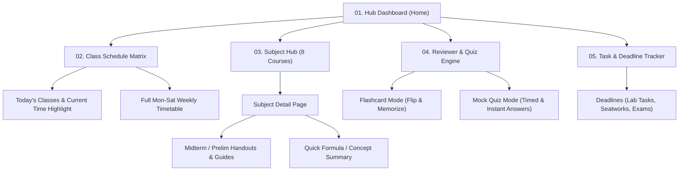

# STI 2G Study Hub — Master Application Blueprint

> [!IMPORTANT]
> **Mission Statement**: A centralized, student-first productivity and academic study platform specifically tailored for **STI West Negros University — BSIT 2G (1st Semester, Midterm Period)**. It unifies weekly class schedules, subject handouts, midterm reviewers, interactive practice quizzes, and deadline tracking into one fast, responsive, and distraction-free interface.

---

## 1. System Overview & Technology Stack

```
+--------------------------------------------------------------------------+
|                        STI 2G STUDY HUB FRONTEND                         |
|  (Responsive Modern Web App: Mobile-friendly for Android & Windows PC)   |
+-------------------------------------+------------------------------------+
                                      |
       +------------------------------+-------------------------------+
       |                              |                               |
       v                              v                               v
+---------------+             +---------------+               +---------------+
|   UI Engine   |             | State & Logic |               | Local Storage |
| Tailwind /    | <---------> | App Store /   | <-----------> | IndexedDB /   |
| Modern CSS    |             | Data Handlers |               | LocalStorage  |
+---------------+             +---------------+               +---------------+
                                      ^
                                      | Reads Static Data
                              +-------+--------+
                              | subjects.json  |
                              | schedule.json  |
                              | reviewers.json |
                              +----------------+
```

### Recommended Technology Stack
* **Frontend**: HTML5, Modern CSS / Tailwind CSS, Modern JavaScript (ES6+ modular components).
* **Storage & Persistence**: `localStorage` + `IndexedDB` for offline-first capabilities (tasks, quiz scores, custom notes persist on your device without needing a paid cloud server).
* **Static Asset Delivery**: Bundled static JSON data for all 8 BSIT 2G subjects, syllabus modules, and schedule tables.
* **Compatibility**: 100% responsive across Android Chrome/Edge and Windows desktop screens.

---

## 2. Information Architecture (App Map)



---

## 3. Data Schemas & Models

To guarantee zero runtime errors and smooth component communication, every data object strictly adheres to these models:

### 3.1 Subject Model (`Subject`)
```json
{
  "id": "COSC1003",
  "code": "COSC1003",
  "title": "Data Structures and Algorithms",
  "units": 3,
  "category": "Major / Technical",
  "room": "Room 402 / Computer Lab 3",
  "instructor": "Instructor Name",
  "colorAccent": "#2563EB",
  "icon": "binary",
  "topics": [
    "Arrays and Linked Lists",
    "Stacks and Queues",
    "Trees and Binary Search Trees",
    "Sorting and Searching Algorithms"
  ]
}
```

### 3.2 Class Schedule Item (`ScheduleSlot`)
```json
{
  "id": "sched_cosc1003_mon",
  "subjectCode": "COSC1003",
  "subjectTitle": "Data Structures and Algorithms",
  "day": "Monday",
  "startTime": "08:00",
  "endTime": "10:00",
  "room": "Lab 3",
  "type": "Laboratory" 
}
```

### 3.3 Study Material / Reviewer Entry (`ReviewerDoc`)
```json
{
  "id": "rev_cosc1007_midterm",
  "subjectCode": "COSC1007",
  "term": "MIDTERM",
  "title": "HCI Heuristic Evaluation & Usability Testing Master Guide",
  "fileType": "pdf",
  "filePath": "handouts/hci_midterm_guide.pdf",
  "dateAdded": "2026-10-05"
}
```

### 3.4 Quiz & Flashcard Item (`QuizItem`)
```json
{
  "id": "q_dsa_01",
  "subjectCode": "COSC1003",
  "term": "MIDTERM",
  "topic": "Stacks & Queues",
  "question": "Which principle does a Queue data structure operate on?",
  "options": [
    "Last-In, First-Out (LIFO)",
    "First-In, First-Out (FIFO)",
    "Random Access",
    "Highest Priority First"
  ],
  "correctAnswerIndex": 1,
  "explanation": "Queues strictly operate on FIFO (First-In, First-Out), where items added first are removed first."
}
```

### 3.5 Academic Task / Milestone (`TaskItem`)
```json
{
  "id": "task_101",
  "subjectCode": "COSC1008",
  "title": "Process Scheduling Simulation Lab Activity",
  "category": "Lab Activity",
  "dueDate": "2026-10-15T23:59:00",
  "priority": "High",
  "isCompleted": false
}
```

---

## 4. Feature Modules Breakdown

### Module 1: Smart Class Schedule Matrix
* **Live "Happening Now / Up Next" banner**: Automatically calculates the current local time against the BSIT 2G timetable and displays the active room and subject.
* **Filter by Day**: Tabbed navigation (Mon, Tue, Wed, Thu, Fri, Sat).
* **Room & Type Tags**: Distinguishes Lecture vs. Computer Lab sessions.

### Module 2: The 8-Subject Repository Hub
Dedicated card grid for the active 2nd Year 1st Sem curriculum:
1. `COSC1001` — Principles of Communication
2. `COSC1003` — Data Structures and Algorithms
3. `COSC1007` — Human-Computer Interaction
4. `COSC1008` — Platform Technology 1 / Operating Systems
5. `GEDC 1006` — Readings in Philippine History
6. `GEDC 1014` — Rizal's Life and Works
7. `INTE1051` — IT Elective I
8. `PHED 1007` — P.E. / PATHFIT 3

* Inside each subject: Quick action buttons for **Handouts**, **Study Guides**, **Reviewers**, and **Quiz Mode**.

### Module 3: Reviewer & Interactive Quizzer
* **Flashcard Mode**: Flip card with question/term on front, definition/answer on back.
* **Practice Quiz Mode**:
  * 10–20 randomized multiple-choice questions per subject.
  * Instant feedback with colored badges (Green for correct, Red for incorrect).
  * High-yield rationales/explanations for every answer.
  * Score summary and review of missed questions.

### Module 4: Deadlines & Milestone Tracker
* Grouped by **Urgent (< 3 days)**, **This Week**, and **Upcoming Midterm Period**.
* Interactive completion checkbox with local persistence.

---

## 5. UI/UX Design System Guidelines

| Element | Specification |
| :--- | :--- |
| **Primary Brand Accent** | STI Navy (`#003366`) & STI Gold (`#F59E0B` / `#FACC15`) |
| **Dark Mode Background** | Slate Dark (`#0F172A`), Cards (`#1E293B`), Borders (`#334155`) |
| **Typography** | Inter / System Sans-Serif (`font-sans`), clean monospace for course codes |
| **Card Styling** | Rounded corners (`16px`), subtle drop-shadow, distinct subject color tags |
| **Interactivity** | Micro-interactions on buttons, smooth tab switching, flip-card 3D effect |

---

## 6. Project Directory Structure

```
C:\Paulo files\My Projects\STI 2G Study Hub\
├── index.html                 # Main single-page application dashboard
├── css/
│   ├── style.css              # Custom styling, dark mode theme, animations
│   └── components.css         # Reusable card, modal, and table styles
├── js/
│   ├── app.js                 # Router, UI state, and global controller
│   ├── schedule.js            # Schedule rendering and current-class ticker
│   ├── quiz.js                # Flashcards and multiple-choice quiz engine
│   ├── tasks.js               # LocalStorage task/deadline manager
│   └── data/
│       ├── subjects.json      # 8 subject metadata and syllabi
│       ├── schedule.json      # Complete BSIT 2G class timetable
│       ├── quizzes.json       # Questions & explanations for Midterms
│       └── handouts.json      # Catalog of study guides & handouts
└── assets/
    ├── icons/                 # Subject and navigation SVG icons
    └── handouts/              # PDF / DOCX study guides repository
```

---

## 7. Phased Implementation Roadmap

1. **Phase 1: Architecture & Data Seed (Immediate Step)**
   * Finalize the exact BSIT 2G weekly schedule (days, times, rooms, instructors).
   * Create the directory structure in `C:\Paulo files\My Projects\STI 2G Study Hub`.
   * Prepare initial static JSON seeds.

2. **Phase 2: Core Shell & Dashboard UI**
   * Build modern responsive layout with navigation sidebar/tabs.
   * Build the "Live Class Ticker" and Schedule Viewer.
   * Render the 8 Subject cards with status badges.

3. **Phase 3: Reviewer & Quiz Engine**
   * Implement flashcard flipping logic.
   * Implement quiz question runner with score tracking and explanations.

4. **Phase 4: Task Tracker & Handout Linking**
   * Connect handouts from `C:\Paulo files\Antigravity Outputs` into the hub.
   * Build local task CRUD (add, check off, delete assignments/activities).
